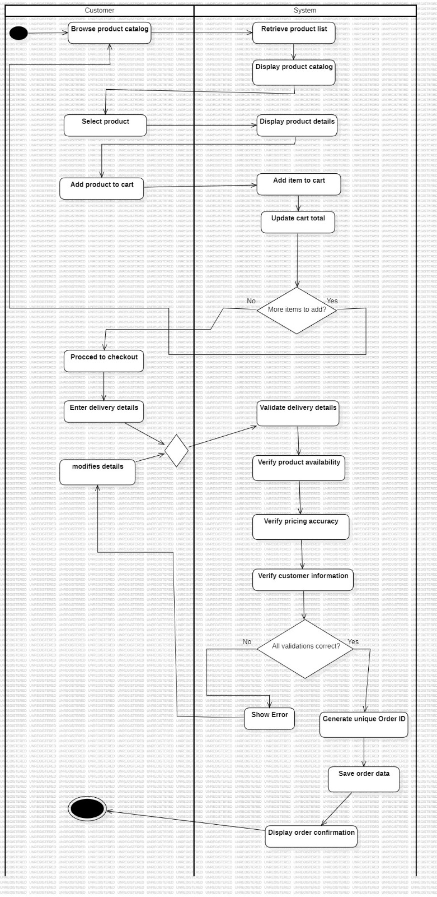
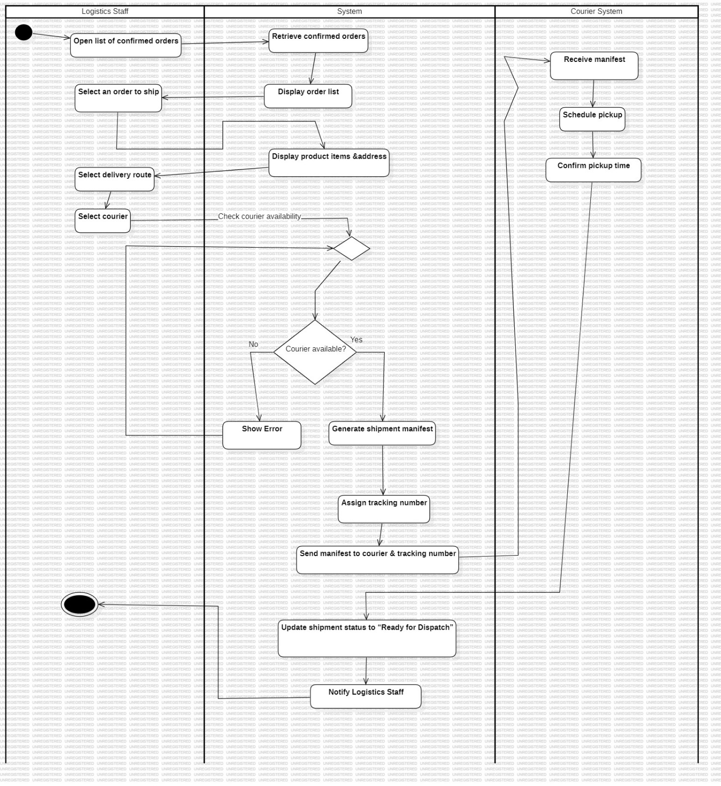
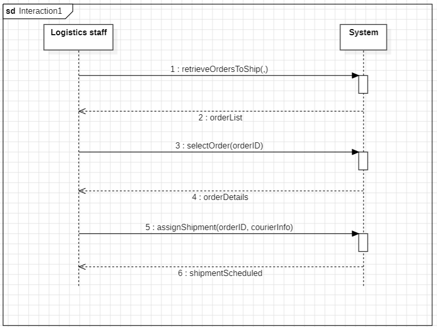
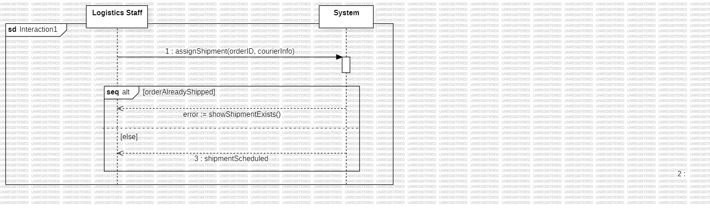
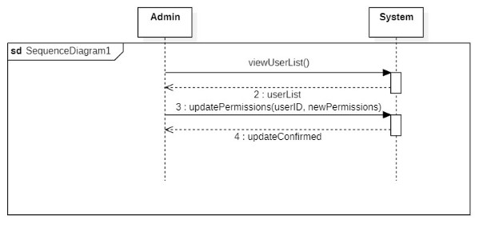
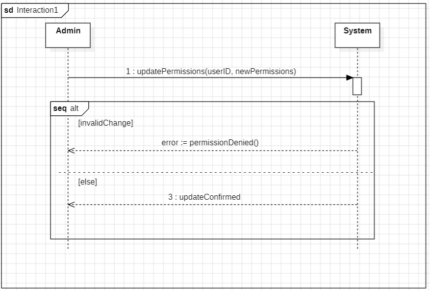
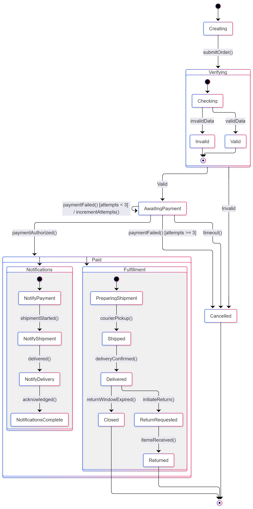
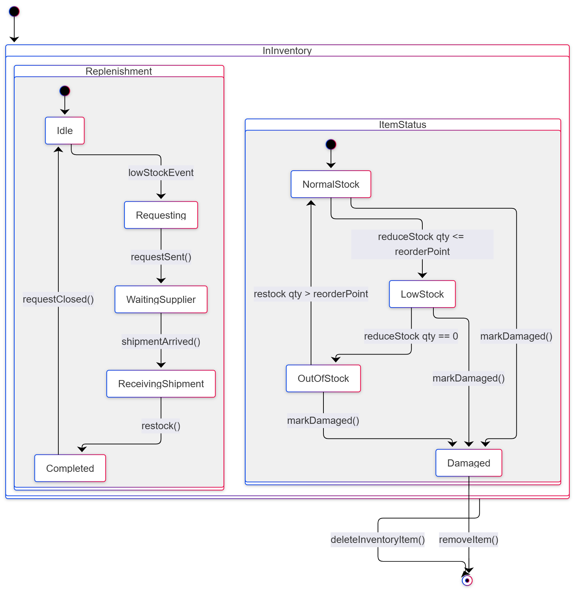
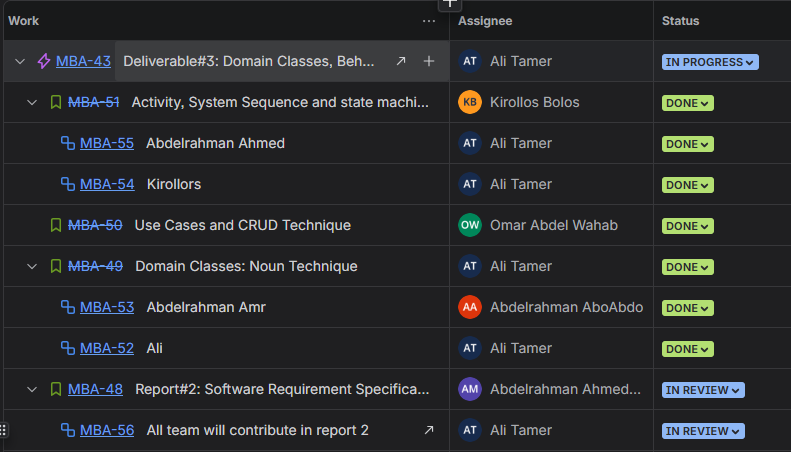
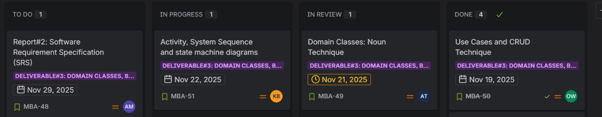

# **Report 1**

# Domain Classes; Noun Technique

## Step 1 — Identify candidate nouns (source: use cases, system vision, technical reports, user stories)

Customer, Order, Order ID, Product, Product Description, Price, Inventory, InventoryItem, Warehouse, Stock Level, Replenishment Request, Supplier, Payment, Payment Authorization, Payment Gateway, Invoice, Shipment, Tracking Number, Courier, Order Status, Return Request, Refund, Customer Support Agent, Staff, SalesStaff, FinanceStaff, InventoryStaff, LogisticsStaff, SupportAgent, Report, KPI, Address, Delivery Details, OrderItem, Quantity, Transaction, Notification (system output).

---

## Step 2 — Refine and classify nouns (Include / Exclude / Research)

Use the textbook decision questions: is it a unique thing the system needs to remember; is it in scope; does the system need to store multiple instances; is it merely an output or attribute?

| Noun                                                                       | Decision                        | Short rationale (trace to project file)                                 |
| -------------------------------------------------------------------------- | ------------------------------- | ----------------------------------------------------------------------- |
| Customer                                                                   | **Include**                     | Appears as primary actor for orders/returns.                            |
| Order                                                                      | **Include**                     | Core transaction; generated Order ID on placement.                      |
| OrderItem                                                                  | **Include**                     | Represents items within Order (quantity, price).                        |
| Product                                                                    | **Include**                     | Managed in catalog; used in verification and inventory.                 |
| InventoryItem                                                              | **Include**                     | Tracks stock levels and reservations.                                   |
| Warehouse                                                                  | **Include**                     | Location for stored inventory.                                          |
| binLocation                                                                | **Exclude (attribute)**         | No bin management use case; keep as attribute if needed.                |
| Supplier                                                                   | **Include**                     | Receives replenishment requests.                                        |
| ReplenishmentRequest                                                       | **Include**                     | Triggered when stock low.                                               |
| Payment                                                                    | **Include**                     | Payment processing and authorization flows present.                     |
| Payment Gateway                                                            | **Exclude (external actor)**    | External system, not a stored domain class.                             |
| Invoice                                                                    | **Include**                     | Generated after payment; appears in scope.                              |
| Shipment                                                                   | **Include**                     | Logistics plans shipments and assigns tracking.                         |
| Courier                                                                    | **Include**                     | External delivery partner referenced in shipment flow.                  |
| ReturnRequest                                                              | **Include**                     | Customer returns/refunds workflow (US9).                                |
| Refund                                                                     | **Exclude (process/attribute)** | Handled within ReturnRequest or Payment status.                         |
| Staff (abstract)                                                           | **Include**                     | Multiple staff roles appear as actors.                                  |
| SalesStaff / FinanceStaff / InventoryStaff / LogisticsStaff / SupportAgent | **Include**                     | Domain role specializations (actors).                                   |
| Report                                                                     | **Include**                     | Management reporting use case (US13).                                   |
| Notification (Email/SMS)                                                   | **Exclude (system output)**     | Output/event, not persistent domain class.                              |
| ProductCatalog                                                             | **Exclude**                     | Catalog referenced conceptually; project stores Product instances only. |

---

## Step 3 — Produce final domain class list

Customer; Order; OrderItem; Product; InventoryItem; Warehouse; Supplier; ReplenishmentRequest; Payment; Invoice; Shipment; Courier; ReturnRequest; Staff (abstract) and subclasses (SalesStaff, FinanceStaff, InventoryStaff, LogisticsStaff, SupportAgent); Report.

---

## Step 4 — For each included class: candidate key attributes

| Domain class             | Key attributes (candidates)                                                                 |
| ------------------------ | ------------------------------------------------------------------------------------------- |
| **Customer**             | customerId {key}, fullName, email, phone, defaultAddress                                    |
| **Order**                | orderId {key}, orderDate, status, totalAmount, customerId (FK)                              |
| **OrderItem**            | orderItemId {key}, orderId (FK), productId (FK), quantity, unitPrice, lineTotal             |
| **Product**              | productId {key}, sku, name, description, price, category                                    |
| **InventoryItem**        | inventoryId {key}, productId (FK), warehouseId (FK), quantityOnHand, reorderPoint, status   |
| **Warehouse**            | warehouseId {key}, name, location                                                           |
| **Supplier**             | supplierId {key}, name, contactInfo                                                         |
| **ReplenishmentRequest** | requestId {key}, productId (FK), supplierId (FK), quantity, requestDate, status             |
| **Payment**              | paymentId {key}, orderId (FK), amount, method, authorizationCode, status, paymentDate       |
| **Invoice**              | invoiceId {key}, orderId (FK), invoiceDate, total, tax, shippingCharges                     |
| **Shipment**             | shipmentId {key}, orderId (FK), courierId (FK), trackingNumber, shipDate, estimatedDelivery |
| **Courier**              | courierId {key}, name, contactInfo, apiEndpoint                                             |
| **ReturnRequest**        | returnId {key}, orderId (FK), reason, requestDate, status                                   |
| **Staff (abstract)**     | staffId {key}, fullName, role                                                               |
| **Report**               | reportId {key}, type, generatedDate, parameters                                             |

---

## Step 5 — Preliminary relationships, type, and multiplicity

| From                 | To                                                                     | Relationship type | Multiplicity (From → To)                        | Rationale / trace                                             |
| -------------------- | ---------------------------------------------------------------------- | ----------------- | ----------------------------------------------- | ------------------------------------------------------------- |
| Customer             | Order                                                                  | association       | Customer `1` → Order `0..*`                     | Customer places many orders.                                  |
| Order                | OrderItem                                                              | **composition**   | Order `1` — OrderItem `1..*`                    | Order owns its items; items don't exist without order.        |
| OrderItem            | Product                                                                | association       | OrderItem `*` → Product `1`                     | Each order line refers to a product.                          |
| Product              | InventoryItem                                                          | aggregation       | Product `1` o-- `0..*` InventoryItem            | Inventory entries reference products.                         |
| Warehouse            | InventoryItem                                                          | association       | Warehouse `1` → InventoryItem `0..*`            | Warehouse stores inventory records.                           |
| InventoryItem        | ReplenishmentRequest                                                   | association       | InventoryItem `1` → ReplenishmentRequest `0..*` | Low stock triggers replenishment.                             |
| ReplenishmentRequest | Supplier                                                               | association       | ReplenishmentRequest `*` → Supplier `1`         | Requests are sent to supplier.                                |
| Order                | Payment                                                                | association       | Order `1` → Payment `0..*`                      | Multiple payment attempts/records possible.                   |
| Order                | Invoice                                                                | association       | Order `1` → Invoice `1..1`                      | Invoice generated per order (adjust if split invoicing used). |
| Order                | Shipment                                                               | association       | Order `1` → Shipment `0..*`                     | Allow split shipments.                                        |
| Shipment             | Courier                                                                | association       | Shipment `*` → Courier `1`                      | Courier assigned to each shipment.                            |
| Order                | ReturnRequest                                                          | association       | Order `1` → ReturnRequest `0..*`                | Returns reference orders.                                     |
| Staff                | Report                                                                 | association       | Staff `0..*` → Report `0..*`                    | Staff generate or request reports.                            |
| Staff (abstract)     | SalesStaff, FinanceStaff, InventoryStaff, LogisticsStaff, SupportAgent | generalization    | —                                               | Role specializations for actor mapping.                       |

---

## Step 6 — Class Diagram

![[domain-model-class-diagram.png]]

---

# CRUD Technique

## CRUD Technique Applied to Final Use Cases

## 1. Final Validated Use Case List

After applying the CRUD Technique and removing non-actor-goal use cases, the final set of valid use cases is:

1. **Place Online Order**
2. **Process Customer Payment**
3. **Manage Product Catalog**
4. **Plan Shipment**
5. **Track Order Status**
6. **Initiate Return Request**
7. **Look Up Order History**
8. **Generate Management Reports**
9. **Manage User Permissions**

---

## 2. Use Cases Removed or Merged

### Merged Use Cases

The following use cases were **merged** because they do not represent independent goals of any actor. Instead, they are **internal system responsibilities** that logically fall under larger, actor-driven use cases.

| **Removed / Merged Use Case**    | **Merged Into**                                                                                       | **Reason for Merge**                                                                                                                                                        |
| -------------------------------- | ----------------------------------------------------------------------------------------------------- | --------------------------------------------------------------------------------------------------------------------------------------------------------------------------- |
| **Handle Payment Authorization** | **Process Customer Payment**                                                                          | Authorization is part of the internal payment workflow (communicating with the payment gateway, confirming funds). No actor starts this step manually.                      |
| **Verify Order Details**         | **Place Online Order**                                                                                | The system automatically checks product availability, addresses, totals, and customer data during order placement. Customers do not trigger a separate "verify" action.   |
| **Reserve Inventory**            | **Manage Product Catalog** _(inventory logic)_ + **Place Online Order / Process Payment** _(trigger)_ | Inventory reservation happens automatically when an order is placed/paid. It is not a user request and does not appear as a standalone goal.                              |
| **Send Replenishment Request**   | **Manage Product Catalog**                                                                            | Replenishment is automatic when stock is low. No staff explicitly triggers “send supplier request” as a separate use case.                                                  |
| **Transmit Shipment Manifest**   | **Plan Shipment**                                                                                     | Sending the shipment manifest to the courier system is part of the shipment planning workflow. No actor initiates this step independently.                                |

---

### Removed Use Cases (Invalid Actor-Goal Use Cases)

The following were removed because they do **not** represent goals initiated by a human actor. They are **system-maintenance or internal process steps**, not true use cases:

- Verify Order Details
- Reserve Inventory
- Send Replenishment Request
- Transmit Shipment Manifest
- Handle Payment Authorization

All remaining use cases are valid actor-goal interactions.

---

## 3. CRUD Analysis by Data Entity

The CRUD validation for each major domain entity.

---

### 3.1 Entity: Order

| CRUD Operation      | Related Use Cases                                                                 |
|---------------------|-----------------------------------------------------------------------------------|
| **Create**          | Place Online Order                                                                |
| **Read**            | Track Order Status, Look Up Order History, Generate Management Reports            |
| **Update**          | Place Online Order, Process Customer Payment, Plan Shipment                       |
| **Delete/Archive**  | Initiate Return Request                                                           |

---

### 3.2 Entity: Payment

| CRUD Operation      | Related Use Cases                                             |
|---------------------|---------------------------------------------------------------|
| **Create**          | Process Customer Payment                                      |
| **Read**            | Look Up Order History, Generate Management Reports            |
| **Update**          | Process Customer Payment (status update)                      |
| **Delete/Archive**  | Initiate Return Request (refund resolution)                   |

---

### 3.3 Entity: Inventory Item

| CRUD Operation      | Related Use Cases                                                                         |
|---------------------|-------------------------------------------------------------------------------------------|
| **Create**          | Manage Product Catalog                                                                    |
| **Read**            | Place Online Order, Generate Management Reports                                           |
| **Update**          | Manage Product Catalog (edit), Place Online Order / Process Payment (stock reduction)      |
| **Delete/Archive**  | Manage Product Catalog                                                                    |

---

### 3.4 Entity: Shipment

| CRUD Operation      | Related Use Cases                                                 |
|---------------------|-------------------------------------------------------------------|
| **Create**          | Plan Shipment                                                     |
| **Read**            | Track Order Status                                                |
| **Update**          | Plan Shipment (manifest, courier, routing updates)                |
| **Delete/Archive**  | Not Applicable                                                    |

---

### 3.5 Entity: User / Staff Permissions

| CRUD Operation      | Related Use Cases        |
|---------------------|--------------------------|
| **Create**          | Manage User Permissions  |
| **Read**            | Manage User Permissions  |
| **Update**          | Manage User Permissions  |
| **Delete/Archive**  | Manage User Permissions  |

---

### 3.6 Entity: Product Catalog

| CRUD Operation      | Related Use Cases                          |
|---------------------|--------------------------------------------|
| **Create**          | Manage Product Catalog                     |
| **Read**            | Place Online Order, Generate Management Reports |
| **Update**          | Manage Product Catalog                     |
| **Delete/Archive**  | Manage Product Catalog                     |

---

# Use Cases Event Decomposition Technique

### Table 1:

| Event (Trigger)                              | Type           | Use Case                                | Actor                   |
| :------------------------------------------- | :------------- | :-------------------------------------- | :---------------------- |
| **Customer submits order**                   | External Event | **Place Online Order** (US 7)           | Customer                |
| **Customer submits payment details**         | External Event | **Process Customer Payment** (US 4)     | Customer, Finance staff |
| **Inventory Staff initiates catalog update** | External Event | **Manage Product Catalog** (US 3)       | Inventory Staff         |
| **Inventory confirms order is packaged**     | State Event    | **Plan Shipment** (US 5)                | Logistics Staff         |
| **Customer requests order status**           | External Event | **Track Order Status** (US 8)           | Customer                |
| **Customer submits return request**          | External Event | **Initiate Return Request** (US 9)      | Customer                |
| **Customer Support Agent needs history**     | External Event | **Look Up Order History** (US 6)        | Customer Support Agent  |
| **Time to generate management reports**      | Temporal Event | **Generate Management Reports** (US 13) | Manager / Executive     |
| **System Administrator updates permissions** | External Event | **Manage User Permissions** (US 14)     | System Administrator    |

***

### Table 2:

| Use Case                        | Description                                                                                                                                                                                                                                                                                               |
| :------------------------------ | :-------------------------------------------------------------------------------------------------------------------------------------------------------------------------------------------------------------------------------------------------------------------------------------------------------- |
| **Place Online Order**          | The customer selects products from the catalog, adds them to the shopping cart, provides delivery details, and the system automatically verifies product availability, pricing, and customer information for accuracy before generating a unique Order ID and preparing the order for payment processing. |
| **Process Customer Payment**    | The system securely processes the customer’s chosen payment method by validating details, confirming authorization, verifying funds, recording the transaction, and updating the order status upon success.                                                                                               |
| **Manage Product Catalog**      | Authorized Inventory Staff manage the catalog by adding, updating, or deleting products, while the system tracks inventory, reserves stock for orders, and automatically sends replenishment requests to the Supplier System when stock falls below the reorder point.                                    |
| **Plan Shipment**               | The Logistics Staff finalizes shipment details—including courier selection, delivery routes, and pickup scheduling—and the system automatically sends the shipment manifest with the customer’s address and tracking number to the external Courier System for timely, accurate delivery.                 |
| **Track Order Status**          | Allows the Customer to access the order tracking interface using their tracking ID to view the current operational status (e.g., Shipped, Delivered) and the estimated delivery date.                                                                                                                     |
| **Initiate Return Request**     | Allows the Customer to submit a request for a return or refund via the designated system interface, ensuring the initiation of the returns and refunds workflow.                                                                                                                                          |
| **Look Up Order History**       | Allows the Customer Support Agent to search for and access a complete history of a customer's orders, status, and associated return/refund requests to reduce resolution time.                                                                                                                            |
| **Generate Management Reports** | Provides Managers and Executives with integrated analytical and summary reports displaying current data on Key Performance Indicators (KPIs) to aid in business decisions.                                                                                                                                |
| **Manage User Permissions**     | Allows the System Administrator to manage user roles and specific access permissions for staff to enforce system security and maintain data integrity.                                                                                                                                                    |

---

# Activity Diagram

### Activity Diagram 1:
#### *Place online order*

---

### Activity Diagram 2:
#### *Process Customer Payment*

---

### Activity Diagram 3:
#### *Plan Shipment*

---

# System Sequence Diagram

### SSD 1.1:

---

### SSD 1.2:

---

### SSD 1.3:

---

### SSD 1.4:

---

### SSD 2.1:

---

### SSD 2.2:

---

### SSD 3.1:

---

### SSD 4.1:

---

### SSD 4.2:

---

### SSD 5.1:

---

### SSD 5.2:

---

### SSD 6.1:

---

### SSD 6.2:

---

### SSD 7.1:

---

### SSD 7.2:

---

### SSD 8.1:

---

### SSD 9.1:

---

### SSD 9.2:

---

# State Machine Diagram

### Order State Machine Diagram:

---

### InventoryItem State Machine Diagram:

---
# Jira Project Management Evidence

# GitHub Evidence

Repository Link: [https://github.com/Kiro-create/E-Commerce-Order-Management-System-E-OMS-](https://github.com/Kiro-create/E-Commerce-Order-Management-System-E-OMS-)
(All work, commits and pull requests are visible on GitHub.)

# Conclusion

This report presents a comprehensive and systematic analysis of the **E-Commerce Order Management System (E-OMS)** using three foundational requirements modeling techniques: the **Noun Technique**, **CRUD Analysis**, and **Event Decomposition**. Through these methods, the core domain classes, their attributes, relationships, and behavioral responsibilities have been rigorously identified, validated, and refined to ensure alignment with real-world business workflows and user goals.

The final domain model—comprising classes such as `Customer`, `Order`, `Product`, `InventoryItem`, `Payment`, `Shipment`, and specialized `Staff` roles—accurately reflects the system’s scope and captures essential business rules, including order lifecycle management, inventory control, payment processing, returns, and reporting. The use case list has been purified to include only **actor-initiated goals**, eliminating internal system tasks that do not represent user value, thereby ensuring clarity and focus in system design.

Furthermore, the supporting **activity diagrams**, **system sequence diagrams (SSDs)**, and **state machine diagrams** provide dynamic and behavioral validation of the static domain model, illustrating how objects collaborate over time and how key entities like `Order` and `InventoryItem` transition through well-defined states in response to real-world events.

All artifacts and iterations are documented and maintained in the public GitHub repository ([Kiro-create/E-OMS](https://github.com/Kiro-create/E-Commerce-Order-Management-System-E-OMS-)), demonstrating transparency, version control, and adherence to software engineering best practices.

In summary, this analysis delivers a **robust, coherent, and traceable foundation** for the subsequent design and implementation phases of the E-OMS, ensuring that the resulting system will be both functionally complete and aligned with stakeholder needs.